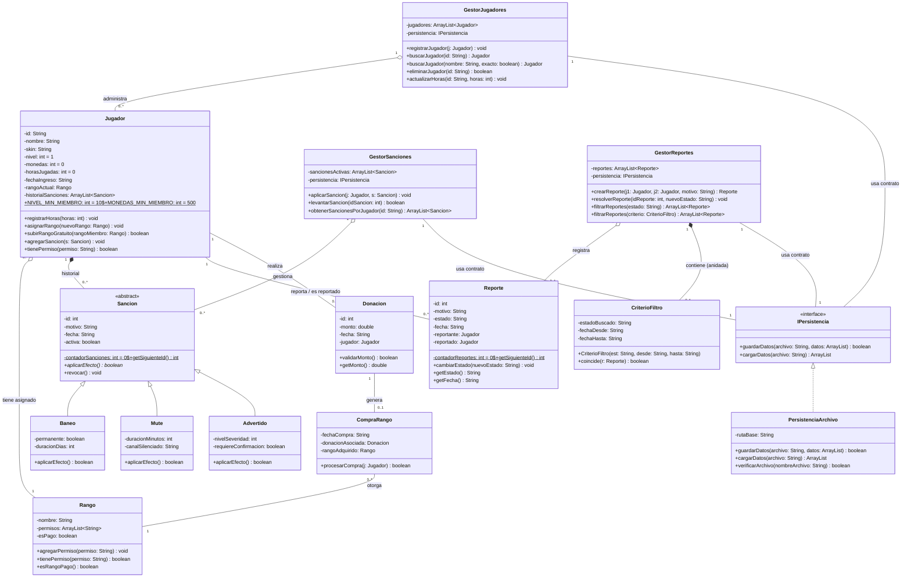

```mermaid
classDiagram
    direction TB

    class Jugador {
        -id: String
        -nombre: String
        -skin: String
        -nivel: int = 1
        -monedas: int = 0
        -horasJugadas: int = 0
        -fechaIngreso: String
        -rangoActual: Rango
        -historialSanciones: ArrayList~Sancion~
        +NIVEL_MIN_MIEMBRO: int = 10$+MONEDAS_MIN_MIEMBRO: int = 500$
        +registrarHoras(horas: int) void
        +asignarRango(nuevoRango: Rango) void
        +subirRangoGratuito(rangoMiembro: Rango) boolean
        +agregarSancion(s: Sancion) void
        +tienePermiso(permiso: String) boolean
    }

    class Rango {
        -nombre: String
        -permisos: ArrayList~String~
        -esPago: boolean
        +agregarPermiso(permiso: String) void
        +tienePermiso(permiso: String) boolean
        +esRangoPago() boolean
    }

    class Donacion {
        -id: int
        -monto: double
        -fecha: String
        -jugador: Jugador
        +validarMonto() boolean
        +getMonto() double
    }

    class CompraRango {
        -fechaCompra: String
        -donacionAsociada: Donacion
        -rangoAdquirido: Rango
        +procesarCompra(j: Jugador) boolean
    }

    class Sancion {
        <<abstract>>
        -id: int
        -motivo: String
        -fecha: String
        -activa: boolean
        -contadorSanciones: int = 0$+getSiguienteId()$ int
        +aplicarEfecto()* boolean
        +revocar() void
    }

    class Baneo {
        -permanente: boolean
        -duracionDias: int
        +aplicarEfecto() boolean
    }

    class Mute {
        -duracionMinutos: int
        -canalSilenciado: String
        +aplicarEfecto() boolean
    }

    class Advertido {
        -nivelSeveridad: int
        -requiereConfirmacion: boolean
        +aplicarEfecto() boolean
    }

    class Reporte {
        -id: int
        -motivo: String
        -estado: String
        -fecha: String
        -reportante: Jugador
        -reportado: Jugador
        -contadorReportes: int = 0$+getSiguienteId()$ int
        +cambiarEstado(nuevoEstado: String) void
        +getEstado() String
        +getFecha() String
    }

    class GestorJugadores {
        -jugadores: ArrayList~Jugador~
        -persistencia: IPersistencia
        +registrarJugador(j: Jugador) void
        +buscarJugador(id: String) Jugador
        +buscarJugador(nombre: String, exacto: boolean) Jugador
        +eliminarJugador(id: String) boolean
        +actualizarHoras(id: String, horas: int) void
    }

    class GestorSanciones {
        -sancionesActivas: ArrayList~Sancion~
        -persistencia: IPersistencia
        +aplicarSancion(j: Jugador, s: Sancion) void
        +levantarSancion(idSancion: int) boolean
        +obtenerSancionesPorJugador(id: String) ArrayList~Sancion~
    }

    class GestorReportes {
        -reportes: ArrayList~Reporte~
        -persistencia: IPersistencia
        +crearReporte(j1: Jugador, j2: Jugador, motivo: String) Reporte
        +resolverReporte(idReporte: int, nuevoEstado: String) void
        +filtrarReportes(estado: String) ArrayList~Reporte~
        +filtrarReportes(criterio: CriterioFiltro) ArrayList~Reporte~
    }

    class CriterioFiltro {
        -estadoBuscado: String
        -fechaDesde: String
        -fechaHasta: String
        +CriterioFiltro(est: String, desde: String, hasta: String)
        +coincide(r: Reporte) boolean
    }

    class IPersistencia {
        <<interface>>
        +guardarDatos(archivo: String, datos: ArrayList) boolean
        +cargarDatos(archivo: String) ArrayList
    }

    class PersistenciaArchivo {
        -rutaBase: String
        +guardarDatos(archivo: String, datos: ArrayList) boolean
        +cargarDatos(archivo: String) ArrayList
        +verificarArchivo(nombreArchivo: String) boolean
    }

    %% Agregación (rombo hueco: las partes existen de forma independiente)
    GestorJugadores "1" o-- "0..*" Jugador : administra
    GestorSanciones "1" o-- "0..*" Sancion : gestiona
    GestorReportes "1" o-- "0..*" Reporte : registra
    Jugador "0..*" o-- "1" Rango : tiene asignado

    %% Composición (rombo relleno: propietario único)
    Jugador "1" *-- "0..*" Sancion : historial
    GestorReportes "1" *-- "0..*" CriterioFiltro : contiene (anidada)

    %% Asociación (dependencia semántica)
    Jugador "1" -- "0..*" Reporte : reporta / es reportado
    Jugador "1" -- "0..*" Donacion : realiza
    Donacion "1" -- "0..1" CompraRango : genera
    CompraRango "0..*" -- "1" Rango : otorga
    GestorJugadores "1" -- "1" IPersistencia : usa contrato
    GestorSanciones "1" -- "1" IPersistencia : usa contrato
    GestorReportes "1" -- "1" IPersistencia : usa contrato

    %% Herencia (relación «es un» - extends)
    Sancion <|-- Baneo
    Sancion <|-- Mute
    Sancion <|-- Advertido

    %% Implementación de Interfaz (firma de contrato - implements)
    IPersistencia <|.. PersistenciaArchivo
```
